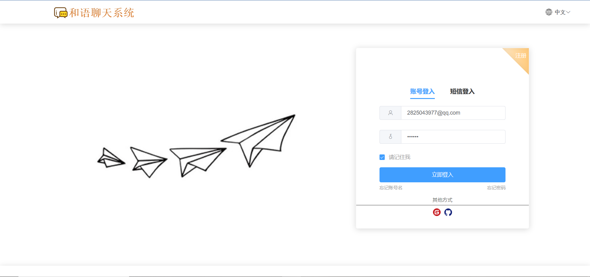
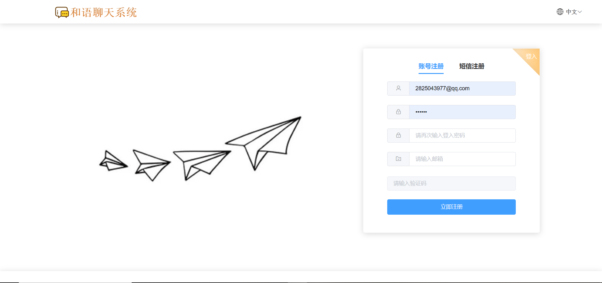
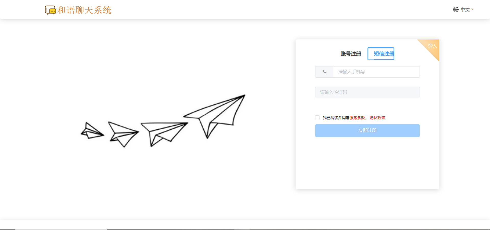
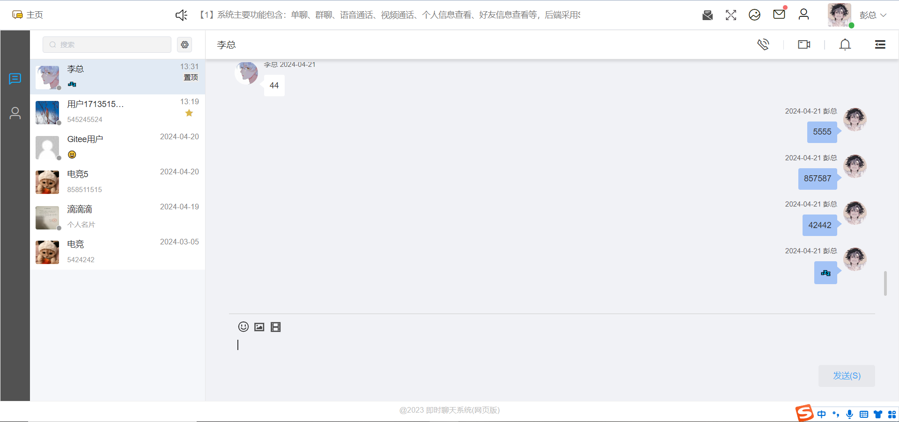
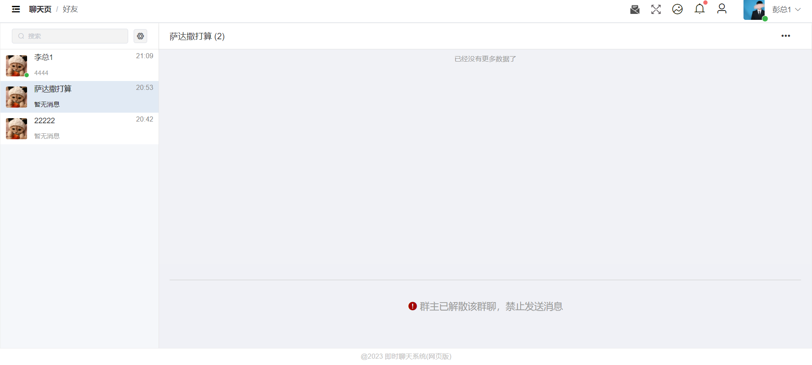
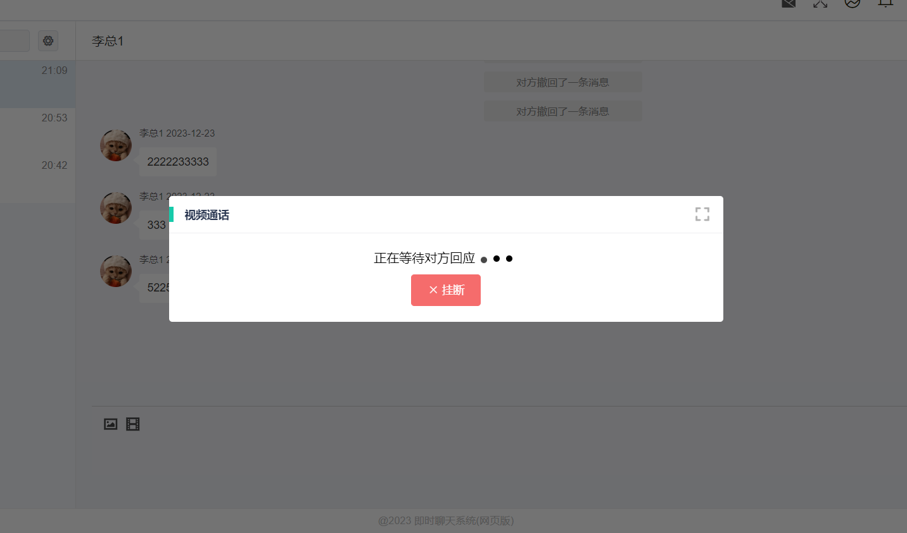
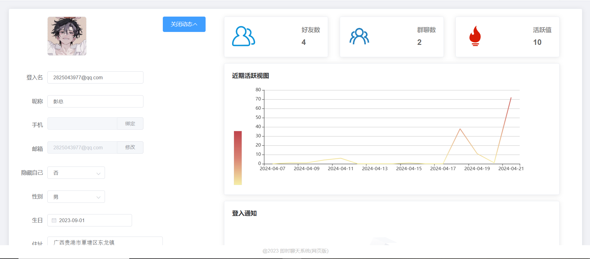

# power
vue后台管理系统模板
见文章: https://juejin.im/post/5e670edde51d4527110a9b40

# 说明
>默认(主)版本为基础框架版

丰富组件 请访问 2.0版本: https://github.com/cgq001/admin-menu/tree/2.0


## 初始化
```
npm install
```
## 运行
```
npm run serve
```
## 打包
```
npm run build
```

# 主要界面
## 登入


## 注册


## 单聊


## 群聊


## 创建群聊


## 好友添加

## 视频通话



## 语音通话


## 个人设置

#
#
# JAVA后端代码仓库地址
https://gitee.com/pengzhenggao/graduation-project
